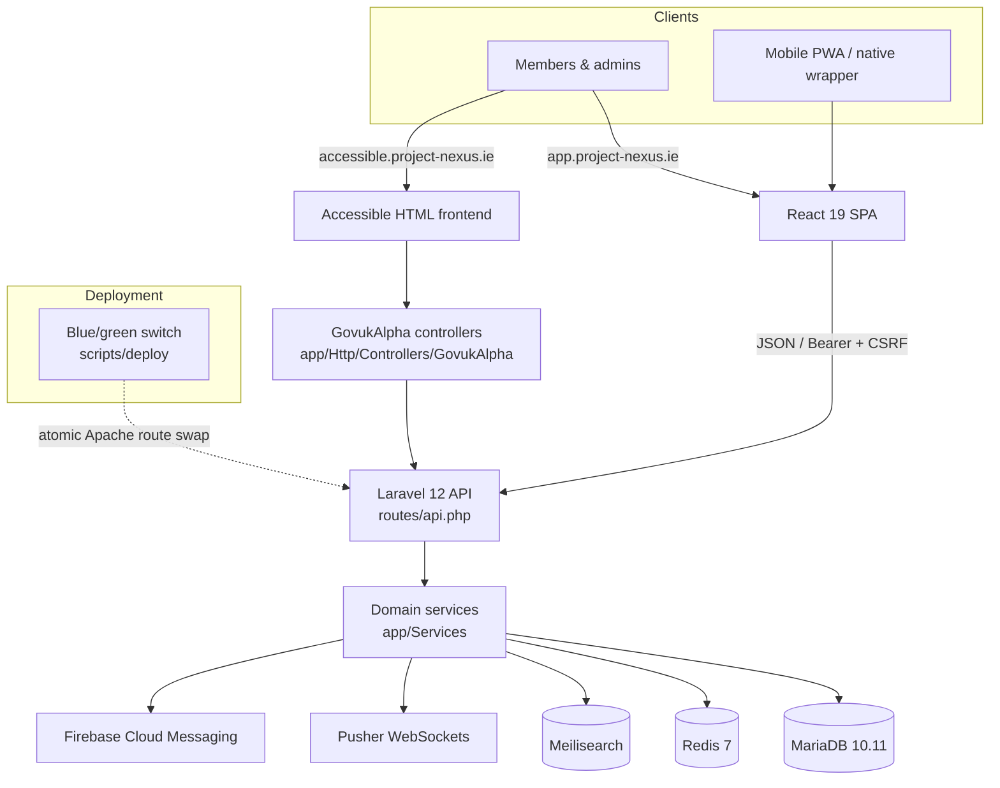

# Project NEXUS

[](https://github.com/jasperfordesq-ai/nexus-v1/actions/workflows/ci.yml)
[](https://github.com/jasperfordesq-ai/nexus-v1/actions/workflows/security-scan.yml)
[](https://www.bestpractices.dev/projects/13344)
[](LICENSE)
[](CHANGELOG.md)
[](composer.json)
[](composer.json)
[](react-frontend/package.json)
[](https://jasperfordesq-ai.github.io/nexus-v1/)

> 📖 **Documentation** — browse the full, searchable documentation site at **<https://jasperfordesq-ai.github.io/nexus-v1/>** (module guides, architecture, and an interactive API reference). The Markdown sources live in [docs/](docs/README.md).

> 🌐 **Live demo** — see the platform running in production: the [React frontend](https://app.project-nexus.ie) (primary UI) and the [accessible HTML-first frontend](https://accessible.project-nexus.ie). The PHP API is served from `https://api.project-nexus.ie`.

> **Version 1.5.4 — Generally Available** — Project NEXUS V1.5.4 is generally available and in active production use. The platform runs on Laravel 12 + PHP 8.2+ with a React 19 frontend. It is currently in use by communities in **Ireland** and being evaluated by communities in the **United Kingdom**, **Spain**, **Switzerland**, and the **United States**. Newer modules may still ship with their own per-module maturity label (Beta / Preview). Contributions and feedback are welcome.

A modern, multi-tenant community time banking platform built with Laravel 12 + PHP 8.2+, React 19, and MariaDB.

## Contents

- [What is Time Banking?](#what-is-time-banking)
- [Features](#features)
- [Tech Stack](#tech-stack)
- [Architecture](#architecture)
- [Repository Topology](#repository-topology)
- [Quick Start](#quick-start)
- [Database Setup](#database-setup)
- [Project Status](#project-status)
- [Quality, Security, and Releases](#quality-security-and-releases)
- [Documentation](#documentation)
- [Contributing & Support](#contributing--support)
- [Credits and Origins](#credits-and-origins)
- [License](#license)
- [UI Attribution Requirement](#ui-attribution-requirement)
- [Related Projects](#related-projects)

## What is Time Banking?

Time banking is a community-based system where members exchange services using time as currency. One hour of service always equals one time credit, regardless of the type of service — everyone's time is valued equally.

## Features

- **Time Credits & Wallet** — Earn and spend time credits for community services
- **Listings Marketplace** — Browse and post service offers and requests
- **Private Messaging** — Connect directly with community members
- **Events** — Organise community gatherings with RSVP tracking
- **Groups** — Interest-based community groups and discussions
- **Social Feed** — Community posts, comments, likes, and polls
- **Gamification** — Badges, achievements, XP, leaderboards, and challenges
- **Volunteering** — Volunteer opportunities and hour logging
- **Blog & Resources** — Community news and shared resource library
- **Federation API** — Multi-community network with cross-community exchanges and federated identity
- **Smart Matching** — AI-powered matching of members and listings
- **Exchange Workflow** — Broker-approved service exchange lifecycle
- **Multi-Tenant** — Run multiple communities from one platform, each with its own branding and configuration
- **PWA & Native Mobile** — Progressive Web App, with native app packaging managed outside the default Docker setup
- **Real-Time** — Pusher WebSockets for live updates, FCM for mobile push
- **Internationalisation** — 11 supported languages: English, Irish (Gaeilge), German, French, Italian, Portuguese, Spanish, Dutch, Polish, Japanese, Arabic (with full RTL support)
- **Light/Dark Theme** — System-aware theme with per-user preference

## Tech Stack

| Layer | Technology |
|-------|-----------|
| **Frontend** | React 19 + TypeScript + HeroUI + Tailwind CSS 4 |
| **Accessible Frontend** | Laravel-rendered HTML + GOV.UK Frontend Sass/JS |
| **Backend API** | Laravel 12 + PHP 8.2+ |
| **Database** | MariaDB 10.11 |
| **Cache** | Redis 7+ |
| **Search** | Meilisearch |
| **CDN** | Cloudflare |
| **Real-Time** | Pusher (WebSockets) + Firebase Cloud Messaging |
| **Dev Environment** | Docker data services + native Vite/PHP on Windows; Docker PHP profile available |
| **Icons** | Lucide React |
| **Animations** | CSS transitions via a local motion shim (no framer-motion) |
| **Charts** | Recharts |
| **Rich Text** | Lexical |

## Architecture

Project NEXUS is a multi-tenant Laravel 12 API with two frontends (a React 19 SPA and an HTML-first accessible frontend), backed by MariaDB, Redis, and Meilisearch, and deployed with a zero-downtime blue/green container switch.



The full architecture map — runtime boundaries, tenant/feature model, and cross-cutting requirements — is in **[docs/ARCHITECTURE.md](docs/ARCHITECTURE.md)**.

## Repository Topology

| Path | Purpose |
|------|---------|
| `app/`, `routes/`, `config/`, `bootstrap/` | Laravel 12 application, API routing, middleware, providers, and runtime configuration |
| `react-frontend/` | Primary React 19 + TypeScript UI for members and current admin workflows |
| `accessible-frontend/` | Accessibility-first, HTML-first frontend served by Laravel at `accessible.project-nexus.ie` and `/{tenantSlug}/alpha/...` |
| `views/` | Live email templates (`views/emails/match_*.php`) and the module-404 page; everything else under `views/` is retired legacy code |
| `httpdocs/` | Apache web root, public health endpoints, and compatibility entrypoints |
| `database/`, `migrations/` | Laravel migrations, schema dump, and legacy SQL history |
| `tests/`, `e2e/`, `playwright.config.ts` | PHPUnit, integration, and browser test coverage |
| `docs/` | Maintained public operations, platform, and governance documentation |
| `.github/` | CI, security, contributor, release, and dependency automation |
| `scripts/` | Build, migration, deployment, maintenance, and audit tooling |

Native mobile project artifacts are not required for the public Docker setup. The React PWA is the canonical user interface; native packaging is release-managed separately from normal local development.

## Quick Start

```bash
# Clone the repository
git clone https://github.com/jasperfordesq-ai/nexus-v1.git
cd nexus-v1

# Copy the example environment file and fill in your values
cp .env.docker.example .env.docker

# Start database, Redis, and Meilisearch
docker compose up -d

# Start Docker PHP if you are using the containerized backend
docker compose --profile docker-php up -d app

# Start the React frontend with native Vite
npm run dev:frontend

# Run Laravel migrations to set up the database schema
docker exec nexus-php-app php artisan migrate

# Access the application
# React Frontend: http://localhost:5173
# PHP API:        http://localhost:8090 (Docker) or http://127.0.0.1:8088 (maintainer native)
# Sales Site:     http://localhost:3001
# Accessible UI:  http://localhost:8090/hour-timebank/alpha

# Native app packaging is separate from the default Docker workflow
```

## Database Setup

Run Laravel migrations after starting Docker to create the schema:

```bash
docker exec nexus-php-app php artisan migrate
```

The full current schema dump is committed at [database/schema/mysql-schema.sql](database/schema/mysql-schema.sql). Zero-downtime deployments use a blue/green container switch (see `scripts/deploy/bluegreen-deploy.sh`).

## Project Status

This is **version 1.5.4 — generally available**, in active production use. Per-module maturity (GA / Beta / Preview) is published on the in-app `/features` page and the public Changelog:

- The **React frontend** (`react-frontend/`) is the primary UI for user-facing pages and current admin workflows
- The **Accessible frontend** (`accessible-frontend/`) is an approved HTML-first UI track for core tenant pages, served by Laravel and planned for `accessible.project-nexus.ie`
- The **Laravel 12 backend** provides the API — all services are native Laravel implementations (zero stubs)
- The **legacy PHP admin** (`/admin-legacy/`, `/super-admin/`) has been decommissioned — all admin workflows live in the React admin
- **Zero-downtime blue/green deployments** — production switches between blue and green container stacks with no maintenance window
- **Native mobile packaging** is managed separately from the default public Docker checkout
- **Tests** are in `tests/`, `react-frontend/src/**/*.test.*`, and `e2e/`; CI also runs static analysis, build, migration, i18n, SPDX, smoke, accessibility, and security gates

We welcome contributors who are comfortable working with a modern Laravel + React codebase.

## Quality, Security, and Releases

- Security reports use the private process in [SECURITY.md](SECURITY.md).
- Contributor behaviour expectations are documented in [CODE_OF_CONDUCT.md](CODE_OF_CONDUCT.md).
- Maintained project documentation starts at [docs/README.md](docs/README.md).
- Public documentation changes are checked with `npm run check:docs`.
- Platform version references are checked with `npm run check:version`; update `VERSION`, Composer, React package metadata, the README, release status, and current public collateral together.
- Release-relevant changes must update [CHANGELOG.md](CHANGELOG.md) under `[Unreleased]`, then refresh the bundled app copy with `npm --prefix react-frontend run copy-changelog`.
- Dependency updates are managed by Dependabot for Composer, npm, Docker, and GitHub Actions.
- Pull requests run dependency review, CI, security scanning, i18n drift checks, SPDX checks, E2E smoke tests, and accessibility checks.
- GitHub Releases are created from version tags; see [.github/RELEASE_PROCESS.md](.github/RELEASE_PROCESS.md).

## Documentation

Maintained documentation starts at **[docs/README.md](docs/README.md)** and follows the standards in [docs/DOCUMENTATION.md](docs/DOCUMENTATION.md) (Diátaxis, Google/GitLab style, OpenAPI-first).

| Area | Start here |
|------|-----------|
| **Architecture** | [docs/ARCHITECTURE.md](docs/ARCHITECTURE.md) |
| **API** | [docs/API.md](docs/API.md) (contract: [`openapi.json`](openapi.json)) |
| **Deployment & operations** | [docs/DEPLOYMENT.md](docs/DEPLOYMENT.md), [docs/RUNBOOK-INCIDENTS.md](docs/RUNBOOK-INCIDENTS.md) |
| **Module guides** | [docs/MODULES.md](docs/MODULES.md) |
| **Frontend conventions** | [react-frontend/CLAUDE.md](react-frontend/CLAUDE.md) |
| **Accessible frontend** | [docs/govuk-alpha/RESEARCH.md](docs/govuk-alpha/RESEARCH.md) |

## Contributing & Support

- **Contributing** — start with [CONTRIBUTING.md](CONTRIBUTING.md) (environment setup, workflow, coding standards, SPDX headers) and the [CONTRIBUTOR_TERMS.md](CONTRIBUTOR_TERMS.md).
- **Project governance** — how the project is maintained and decisions are made: [GOVERNANCE.md](GOVERNANCE.md).
- **Code of conduct** — [CODE_OF_CONDUCT.md](CODE_OF_CONDUCT.md).
- **Getting help** — [SUPPORT.md](SUPPORT.md) explains where to ask questions, report bugs, and request features.
- **Security** — report vulnerabilities privately via [SECURITY.md](SECURITY.md).

## Credits and Origins

### Creator

This software was created by **Jasper Ford**.

### Founders

The originating time bank initiative [hOUR Timebank CLG](https://hour-timebank.ie) was co-founded by:

- **Jasper Ford**
- **Mary Casey**

### Contributors

- **Steven J. Kelly** — Community insight, product thinking
- **Sarah Bird** — CEO, Timebanking UK

### Research Foundation

This software is informed by and builds upon a social impact study commissioned by the **West Cork Development Partnership**.

### Acknowledgements

- **West Cork Development Partnership**
- **Fergal Conlon**, SICAP Manager

### Third-party open-source components

Project NEXUS builds on many open-source projects — including [GrapesJS](https://grapesjs.com) and [MJML](https://mjml.io) (the drag-and-drop newsletter builder), React, HeroUI, Tailwind CSS, and Laravel. Each retains its own licence and copyright; see [THIRD_PARTY_NOTICES.md](THIRD_PARTY_NOTICES.md) (attribution) and [THIRD_PARTY_LICENSES.md](THIRD_PARTY_LICENSES.md) (full inventory). Run `npm run check:licenses` to re-audit the dependency tree.

## License

This software is licensed under the **GNU Affero General Public License version 3** (AGPL-3.0-or-later).

The AGPL requires that if you run a modified version of this software on a server and let others interact with it, you must make your source code available to those users.

See the [LICENSE](LICENSE) file for the full license text.
See the [NOTICE](NOTICE) file for attribution requirements.
See [THIRD_PARTY_NOTICES.md](THIRD_PARTY_NOTICES.md) for bundled third-party components and their licences.

## UI Attribution Requirement

Under AGPL Section 7(b), all public deployments of this software **must** display visible attribution and a link to the source code repository.

### Required Attribution

**Footer (all pages):**
> "Built on Project NEXUS by Jasper Ford"

This text must be a clickable hyperlink to: <https://github.com/jasperfordesq-ai/nexus-v1>

**About page:**
> "Powered by Project NEXUS
> Created by Jasper Ford
> Licensed under AGPL v3"

With a link to: <https://github.com/jasperfordesq-ai/nexus-v1>

### Compliance

- The [NOTICE](NOTICE) file contains the authoritative wording for all attribution requirements
- Removing or obscuring required attribution is a licence violation
- This requirement applies to all deployments, including modified versions and SaaS offerings

## Related Projects

Project NEXUS is moving toward two backend editions that can share the same
React frontend contract:

| Edition | Stack | Repository |
| ------- | ----- | --------- |
| **Laravel Edition** (this repo) | Laravel 12 + PHP 8.2+ / React 19 / MariaDB | [nexus-v1](https://github.com/jasperfordesq-ai/nexus-v1) |
| **.NET Edition** | ASP.NET Core 8 / React 19 / PostgreSQL | [api.project-nexus.net](https://github.com/jasperfordesq-ai/api.project-nexus.net) |

The **Laravel Edition** (this repo) is the canonical, in-production platform and the foundation of all Project NEXUS communities. It runs on Laravel 12 + PHP 8.2+ with the production React 19 frontend. The **.NET Edition** is an experimental, development-only backend that must conform to the Laravel React API contract before it can safely use the same frontend. The portability roadmap and safety rules are documented in [docs/REACT-DUAL-BACKEND.md](docs/REACT-DUAL-BACKEND.md).

## Source Code

The complete source code for this project is available at:
<https://github.com/jasperfordesq-ai/nexus-v1>
