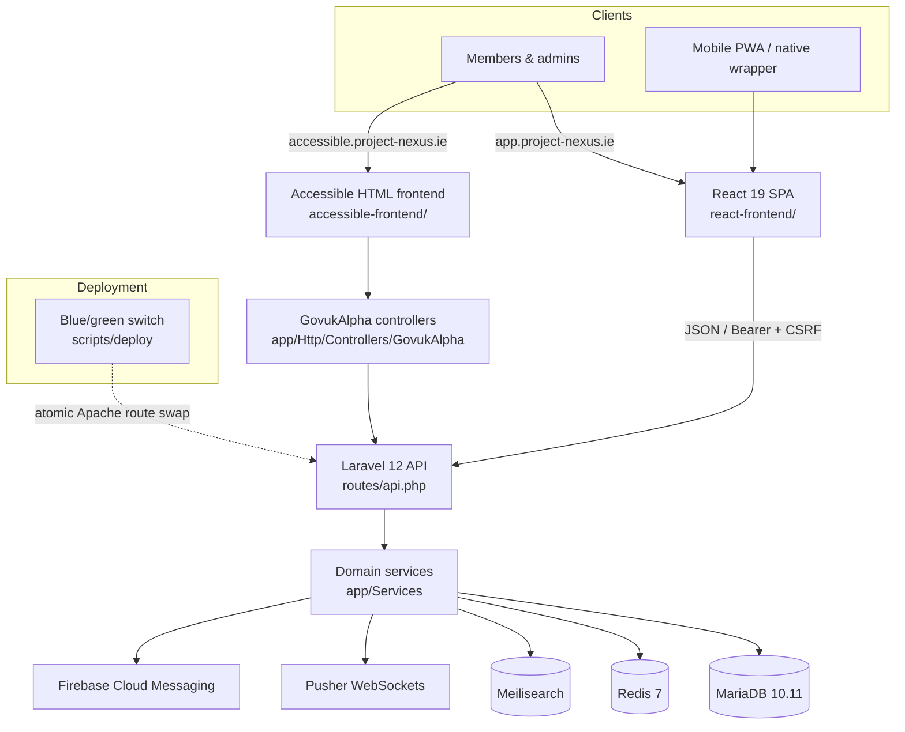

# Project NEXUS Architecture

Last reviewed: 2026-07-14
Platform version: 1.5.6

This document is the maintained architecture map for Project NEXUS. It is intentionally compact: use it to understand the runtime boundaries, primary code paths, and documents to read next.

## System Shape

Project NEXUS is a multi-tenant community platform for timebanking and adjacent community-exchange workflows. The production system is a Laravel 12 API/backend, a React 19 primary frontend, an HTML-first accessible frontend, MariaDB, Redis, Meilisearch, Pusher, Firebase Cloud Messaging, and supporting deployment/observability tooling.

## Runtime Boundaries

| Surface | Primary path | Responsibility |
| --- | --- | --- |
| React app | `react-frontend/` | Main member UI, current admin UI, PWA shell, translated client experience. |
| Accessible frontend | `accessible-frontend/`, `app/Http/Controllers/GovukAlpha/` | HTML-first tenant UI for users who benefit from simpler progressive enhancement. |
| Laravel API | `routes/api.php`, `app/Http/Controllers/Api/` | JSON API for React, mobile, integrations, and admin operations. |
| Domain services | `app/Services/` | Business rules for listings, exchanges, federation, volunteering, messages, notifications, reporting, and adjacent modules. |
| Data model | `database/migrations/`, `database/schema/mysql-schema.sql`, `migrations/` | Current Laravel migrations, schema dump, and historical SQL migration record. |
| Public web root | `httpdocs/` | Apache entrypoints, health endpoints, version endpoint, and compatibility routing. |
| Legacy views | `views/` | Retired PHP UI except the documented live email and module-404 exceptions. |

## Tenant and Feature Model

All business logic must preserve tenant isolation. PHP code should resolve tenant scope through the established tenant context/middleware patterns, and React code should use the tenant context/hooks already present in `react-frontend/src/`.

Feature availability is tenant-configured. User-facing routes, API actions, accessible frontend pages, notifications, search entries, and navigation should all check the same feature gate rather than assuming a module is globally enabled.

## User Interfaces

The React frontend is the primary UI. It uses React 19, TypeScript, HeroUI v3, Tailwind CSS 4, Lucide icons, translation namespaces, CSS tokens, and the local motion shim. New user-facing UI belongs here unless it is specifically part of the accessible frontend.

The production React frontend currently lives in this Laravel repository under `react-frontend/` and speaks the Laravel API contract by default. ASP.NET backend compatibility work must happen by making the ASP.NET API conform to that contract, not by weakening Laravel behaviour in the production frontend. See [REACT-DUAL-BACKEND.md](REACT-DUAL-BACKEND.md) for the switchable-frontend guardrails and the roadmap to move the React frontend into its own repository when contract parity is mature enough.

The accessible frontend is a maintained second surface, not legacy PHP. It uses GOV.UK Frontend markup/classes/Sass/JS with Project NEXUS branding and attribution. Its controller and translation paths must stay isolated from the React app while preserving the same tenant, module, auth, and AGPL attribution rules.

## Backend Organization

Laravel is the sole HTTP handler. Controllers should stay thin and delegate business rules to services. Services should follow existing static/service patterns, tenant scoping, and database conventions already used under `app/Services/`.

New schema changes should use Laravel migrations in `database/migrations/`. The root `migrations/` directory is historical; do not add new legacy SQL migrations.

## Cross-Cutting Requirements

| Requirement | Enforcement |
| --- | --- |
| Translations | End-user React text uses `t(...)`; email/notification PHP text uses translation keys and recipient locale wrapping. |
| Tenant isolation | Middleware, tenant context, scoped queries, and feature gates. |
| Open-source attribution | AGPL Section 7(b) footer/about attribution and `NOTICE` terms. |
| Version consistency | `VERSION` plus `npm run check:version`. |
| Documentation hygiene | `docs/README.md`, [DOCUMENTATION.md](DOCUMENTATION.md), plus `npm run check:docs`. |
| Changelog discipline | `CHANGELOG.md` under `[Unreleased]`, then `npm --prefix react-frontend run copy-changelog`. |

## Operations and Deployment

Production runs on Apache/Plesk/Azure using the blue/green deployment engine under `scripts/deploy/`. Do not deploy without an explicit user instruction. The maintained deployment reference is [DEPLOYMENT.md](DEPLOYMENT.md); incident response and observability references are [RUNBOOK-INCIDENTS.md](RUNBOOK-INCIDENTS.md), [MONITORING.md](MONITORING.md), [SLO.md](SLO.md), and [SENTRY.md](SENTRY.md).

Local development is Docker-first: the Laravel/PHP app, MariaDB, Redis, and Meilisearch run from Docker Compose, while the default React workflow uses native Vite for fast HMR and proxies `/api` to the Docker PHP app. The Docker frontend profile exists for container-specific frontend checks.

## Documentation Sufficiency

The maintained documentation covers setup, topology, deployment, incident response, monitoring, SLOs, Sentry, API reference policy, testing, security scanning, federation, custom domains, accessible frontend constraints, contributor terms, versioning, and changelog discipline. Every live product module has a curated guide under `docs/modules/`; federation, mobile, and the accessible frontend use dedicated cross-cutting references linked from [MODULES.md](MODULES.md).

The ongoing risk is implementation drift. Update the relevant guide and machine-readable API contract in the same change as behaviour, keep every maintained page indexed from [README.md](README.md), and run the documentation, version, and changelog checks before release.
